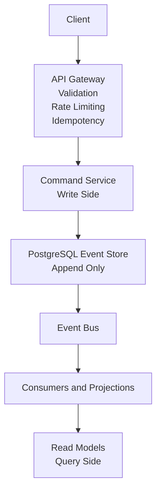
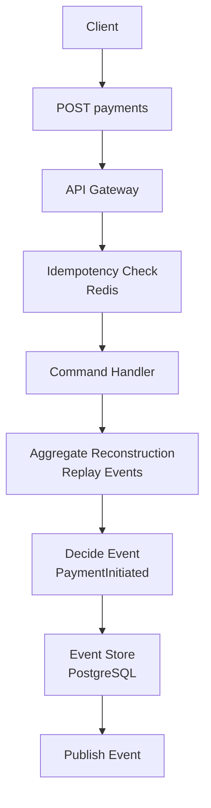
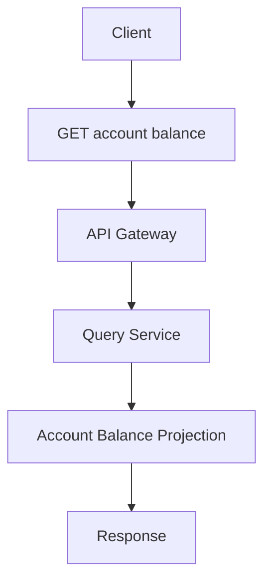

---

# UPI Event-Driven Payment System

A **UPI-like digital payments backend** built using **Event-Driven Architecture**,
**CQRS (Command Query Responsibility Segregation)**, and **Event Sourcing**.

This system prioritizes **correctness, idempotency, replayability, and failure recovery**, rather than direct database state mutation.

---

## Key Characteristics

* Event-driven, append-only data model
* Clear separation of write and read paths (CQRS)
* Immutable PostgreSQL event store
* Redis-backed idempotency for safe retries
* Replayable projections and deterministic recovery
* Stateless services
* Cloud-ready (Docker + AWS EC2)

---

## Architecture Overview

### High-Level Architecture



**Explanation**

* Clients interact only with the API Gateway
* Writes generate immutable domain events
* Reads are served from pre-computed projections
* The event store is the single source of truth

---

## Write Path (Command Flow)



**Guarantees**

* One command produces exactly one event
* Safe retries via idempotency keys
* No direct state mutation
* Strict ordering per aggregate

---

## Read Path (Query Flow)



**Why this works**

* Reads never touch the event store
* Fast query performance
* Read models are disposable and rebuildable

---

## Folder Structure

```text
upi-event-driven-system/
├── api-gateway/        # Single runtime container
├── command-service/    # Write side (CQRS)
├── query-service/      # Read side (CQRS)
├── event-consumers/    # Projections and async handlers
├── shared/             # Domain contracts (events, commands)
├── docs/               # Architecture & design docs
├── db/                 # Event store schema & init scripts
├── docker-compose.yml
├── .env

---

## Event Store

PostgreSQL is used as an **append-only event store**.

* No UPDATE operations
* No DELETE operations
* Deterministic replay supported

Schema:

```sql
CREATE TABLE events (
  event_id UUID PRIMARY KEY,
  aggregate_id VARCHAR(64) NOT NULL,
  aggregate_type VARCHAR(32) NOT NULL,
  event_type VARCHAR(64) NOT NULL,
  version INT NOT NULL,
  payload JSONB NOT NULL,
  created_at TIMESTAMP NOT NULL DEFAULT NOW(),
  UNIQUE (aggregate_id, version)
);
```

---

## Idempotency

* Redis-backed idempotency store
* Prevents duplicate command execution
* Same idempotency key always returns the same result
* TTL-based cleanup

---

## Deployment

* Docker Compose based setup
* Infrastructure services:

  * PostgreSQL (Event Store)
  * Redis (Idempotency)
* Successfully deployed on **AWS EC2**
* No localhost dependencies (Docker DNS based)

---

## Current Status

### Completed

* CQRS + Event Sourcing architecture
* Append-only event store
* Redis idempotency
* Read-side projections
* Dockerized deployment
* Production deployment on AWS EC2

### In Progress

* Account debit / credit workflow
* Payment completion events
* External message broker (Kafka / RabbitMQ)

---

## Why This Architecture

This system is designed like **real financial backends**:

* Every state change is traceable
* System recovers safely from crashes
* Services restart without data loss
* Behavior is auditable and explainable

---

## Documentation

* docs/architecture.md – detailed system design
* docs/failure-handling.md – retries, replay, recovery
* docs/deployment.md – EC2 & Docker setup

---

## Tech Stack

* TypeScript / Node.js
* PostgreSQL
* Redis
* Docker & Docker Compose
* AWS EC2
* CQRS & Event Sourcing


